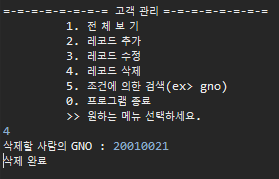

# 5월12일 고객MVC JDBC 과제

### 역할
* 송기석 : insert
* 박광우 : select
* 이영서 : update
* 진승현 : delete

### 프로젝트 클론 후 할 일
1. src/main/lib/oracle.properties 파일 내 자신의 DB정보 입력하기
2. jdbc 관련 라이브러리 다운로드 후 프로젝트에 추가 [ojdbc8 다운로드 링크](https://www.oracle.com/kr/database/technologies/appdev/jdbc-downloads.html)

### 프로젝트 
* 메뉴  

* 전체 조회  

* 레코드 추가  

* 레코드 수정  

* 레코드 삭제  

* 조건에 의한 검색(ex> gno)  

* 프로그램 종료  

### 에러
* OracleDriver 관련 [ojdbc8 다운로드 링크](https://www.oracle.com/kr/database/technologies/appdev/jdbc-downloads.html)
  ojdbc8-full.tar.gz 다운 후 ojdbc8.jar oraclepki.jar 프로젝트 BuildPath에 추가